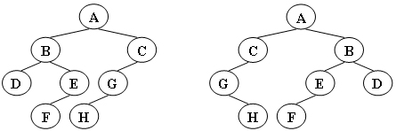
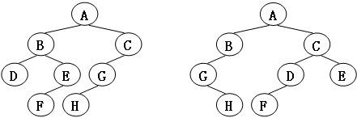

# 6-2 Isomorphic (7 分)

Two trees, `T1` and `T2`, are **isomorphic** if `T1` can be transformed into `T2` by swapping left and right children of (some of the) nodes in `T1`. For instance, the two trees in Figure 1 are isomorphic because they are the same if the children of A, B, and G, but not the other nodes, are swapped. Give a polynomial time algorithm to decide if two trees are isomorphic.

  
Figure1

### Format of functions:

```c
int Isomorphic( Tree T1, Tree T2 );
```

where `Tree` is defined as the following:

```c
typedef struct TreeNode *Tree;
struct TreeNode {
    ElementType Element;
    Tree  Left;
    Tree  Right;
};
```

The function is supposed to return 1 if `T1` and `T2` are indeed isomorphic, or 0 if not.

### Sample program of judge:

```c
#include <stdio.h>
#include <stdlib.h>

typedef char ElementType;

typedef struct TreeNode *Tree;
struct TreeNode {
    ElementType Element;
    Tree  Left;
    Tree  Right;
};

Tree BuildTree(); /* details omitted */

int Isomorphic( Tree T1, Tree T2 );

int main()
{
    Tree T1, T2;
    T1 = BuildTree();
    T2 = BuildTree();
    printf(“%d\n”, Isomorphic(T1, T2));
    return 0;
}

/* Your function will be put here */
```

### Sample Output 1 (for the trees shown in Figure 1):

```out
1
```

### Sample Output 2 (for the trees shown in Figure 2):

```out
0
```

  
Figure2
