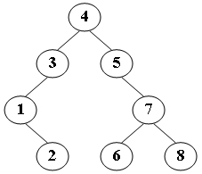
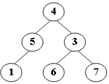

# 6-1 CheckBST[1] (13 分)

Given a binary tree, you are supposed to tell if it is a binary search tree. If the answer is yes, try to find the *K*-th largest key, else try to find the height of the tree.

### Format of function:

```c
int CheckBST ( BinTree T, int K );
```

where `BinTree` is defined as the following:

```c
typedef struct TNode *BinTree;
struct TNode{
    int Key;
    BinTree Left;
    BinTree Right;
};
```

The function `CheckBST` is supposed to return the `K`-th largest key if `T` is a binary search tree; or if not, return the negative height of `T` (for example, if the height is 5, you must return −5).

Here the height of a leaf node is defined to be 1. `T` is not empty and all its keys are positive integers. `K` is positive and is never more than the total number of nodes in the tree.

### Sample program of judge:

```c
#include <stdio.h>
#include <stdlib.h>

typedef struct TNode *BinTree;
struct TNode{
    int Key;
    BinTree Left;
    BinTree Right;
};

BinTree BuildTree(); /* details omitted */
int CheckBST ( BinTree T, int K );

int main()
{
    BinTree T;
    int K, out;

    T = BuildTree();
    scanf("%d", &K);
    out = CheckBST(T, K);
    if ( out < 0 )
        printf("No.  Height = %d\n", -out);
    else
        printf("Yes.  Key = %d\n", out);

    return 0;
}
/* 你的代码将被嵌在这里 */
```

### Sample Input 1: (for the following tree)



```
4
```

### Sample Output 1:

```out
Yes.  Key = 5
```

### Sample Input 2: (for the following tree)



```
3
```

### Sample Output 2:

```
No.  Height = 3
```
