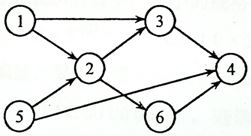

# 6-1 Is Topological Order (12 分)

Write a program to test if a give sequence `Seq` is a topological order of a given graph `Graph`.

### Format of functions:

```c
bool IsTopSeq( LGraph Graph, Vertex Seq[] );
```

where `LGraph` is defined as the following:

```c
typedef struct AdjVNode *PtrToAdjVNode; 
struct AdjVNode{
    Vertex AdjV;
    PtrToAdjVNode Next;
};

typedef struct Vnode{
    PtrToAdjVNode FirstEdge;
} AdjList[MaxVertexNum];

typedef struct GNode *PtrToGNode;
struct GNode{  
    int Nv;
    int Ne;
    AdjList G;
};
typedef PtrToGNode LGraph;
```

The function `IsTopSeq` must return `true` if `Seq` does correspond to a topological order; otherwise return `false`.

**Note:** Although the vertices are numbered from 1 to MaxVertexNum, they are **indexed from 0** in the LGraph structure.

### Sample program of judge:

```c
#include <stdio.h>
#include <stdlib.h>

typedef enum {false, true} bool;
#define MaxVertexNum 10  /* maximum number of vertices */
typedef int Vertex;      /* vertices are numbered from 1 to MaxVertexNum */

typedef struct AdjVNode *PtrToAdjVNode; 
struct AdjVNode{
    Vertex AdjV;
    PtrToAdjVNode Next;
};

typedef struct Vnode{
    PtrToAdjVNode FirstEdge;
} AdjList[MaxVertexNum];

typedef struct GNode *PtrToGNode;
struct GNode{  
    int Nv;
    int Ne;
    AdjList G;
};
typedef PtrToGNode LGraph;

LGraph ReadG(); /* details omitted */

bool IsTopSeq( LGraph Graph, Vertex Seq[] );

int main()
{
    int i, j, N;
    Vertex Seq[MaxVertexNum];
    LGraph G = ReadG();
    scanf("%d", &N);
    for (i=0; i<N; i++) {
        for (j=0; j<G->Nv; j++)
            scanf("%d", &Seq[j]);
        if ( IsTopSeq(G, Seq)==true ) printf("yes\n");
        else printf("no\n");
    }

    return 0;
}

/* Your function will be put here */
```

### Sample Input (for the graph shown in the figure):



```in
6 8
1 2
1 3
5 2
5 4
2 3
2 6
3 4
6 4
5
1 5 2 3 6 4
5 1 2 6 3 4
5 1 2 3 6 4
5 2 1 6 3 4
1 2 3 4 5 6
```

### Sample Output:

```out
yes
yes
yes
no
no
```
