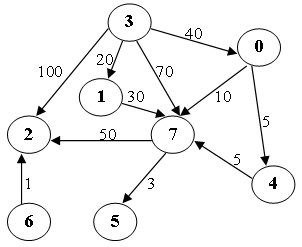

# 6-1 Shortest Path [3] (8 分)

Write a program to not only find the weighted shortest distances, but also count the number of different minimum paths from any vertex to a given source vertex in a digraph. It is guaranteed that all the weights are positive.

### Format of functions:

```c++
void ShortestDist( MGraph Graph, int dist[], int count[], Vertex S );
```

where `MGraph` is defined as the following:

```c
typedef struct GNode *PtrToGNode;
struct GNode{
    int Nv;
    int Ne;
    WeightType G[MaxVertexNum][MaxVertexNum];
};
typedef PtrToGNode MGraph;
```

The shortest distance from `V` to the source `S` is supposed to be stored in `dist[V]`. If `V` cannot be reached from `S`, store -1 instead. The number of different minimum paths from `V` to the source `S` is supposed to be stored in `count[V]` and `count[S]=1`.

### Sample program of judge:

```c
#include <stdio.h>
#include <stdlib.h>

typedef enum {false, true} bool;
#define INFINITY 1000000
#define MaxVertexNum 10  /* maximum number of vertices */
typedef int Vertex;      /* vertices are numbered from 0 to MaxVertexNum-1 */
typedef int WeightType;

typedef struct GNode *PtrToGNode;
struct GNode{
    int Nv;
    int Ne;
    WeightType G[MaxVertexNum][MaxVertexNum];
};
typedef PtrToGNode MGraph;

MGraph ReadG(); /* details omitted */

void ShortestDist( MGraph Graph, int dist[], int count[], Vertex S );

int main()
{
    int dist[MaxVertexNum], count[MaxVertexNum];
    Vertex S, V;
    MGraph G = ReadG();

    scanf("%d", &S);
    ShortestDist( G, dist, count, S );

    for ( V=0; V<G->Nv; V++ )
        printf("%d ", dist[V]);
    printf("\n");
    for ( V=0; V<G->Nv; V++ )
        printf("%d ", count[V]);
    printf("\n");

    return 0;
}

/* Your function will be put here */
```

### Sample Input (for the graph shown in the figure):



```
8 11
0 4 5
0 7 10
1 7 30
3 0 40
3 1 20
3 2 100
3 7 70
4 7 5
6 2 1
7 5 3
7 2 50
3
```

### Sample Output:

```out
40 20 100 0 45 53 -1 50 
1 1 4 1 1 3 0 3 
```