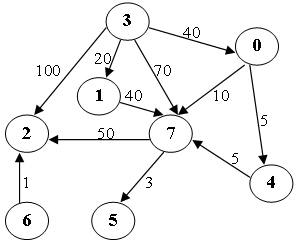

# 6-2 Shortest Path [4] (8 分)

Write a program to find the weighted shortest distances from any vertex to a given source vertex in a digraph. If there is more than one minimum path from v to w, a path with the fewest number of edges is chosen. It is guaranteed that all the weights are positive and such a path is unique for any vertex.

### Format of functions:

```c
void ShortestDist( MGraph Graph, int dist[], int path[], Vertex S );
```

where `MGraph` is defined as the following:

```c
typedef struct GNode *PtrToGNode;
struct GNode{
    int Nv;
    int Ne;
    WeightType G[MaxVertexNum][MaxVertexNum];
};
typedef PtrToGNode MGraph;
```

The shortest distance from `V` to the source `S` is supposed to be stored in `dist[V]`. If `V` cannot be reached from `S`, store -1 instead. If `W` is the vertex being visited right before `V` along the shortest path from `S` to `V`, then `path[V]=W`. If `V` cannot be reached from `S`, `path[V]=-1`, and we have `path[S]=-1`.

### Sample program of judge:

```c
#include <stdio.h>
#include <stdlib.h>

typedef enum {false, true} bool;
#define INFINITY 1000000
#define MaxVertexNum 10  /* maximum number of vertices */
typedef int Vertex;      /* vertices are numbered from 0 to MaxVertexNum-1 */
typedef int WeightType;

typedef struct GNode *PtrToGNode;
struct GNode{
    int Nv;
    int Ne;
    WeightType G[MaxVertexNum][MaxVertexNum];
};
typedef PtrToGNode MGraph;

MGraph ReadG(); /* details omitted */

void ShortestDist( MGraph Graph, int dist[], int path[], Vertex S );

int main()
{
    int dist[MaxVertexNum], path[MaxVertexNum];
    Vertex S, V;
    MGraph G = ReadG();

    scanf("%d", &S);
    ShortestDist( G, dist, path, S );

    for ( V=0; V<G->Nv; V++ )
        printf("%d ", dist[V]);
    printf("\n");
    for ( V=0; V<G->Nv; V++ )
        printf("%d ", path[V]);
    printf("\n");

    return 0;
}

/* Your function will be put here */
```

### Sample Input (for the graph shown in the figure):



```
8 11
0 4 5
0 7 10
1 7 40
3 0 40
3 1 20
3 2 100
3 7 70
4 7 5
6 2 1
7 5 3
7 2 50
3
```

### Sample Output:

```out
40 20 100 0 45 53 -1 50 
3 3 3 -1 0 7 -1 0 
```